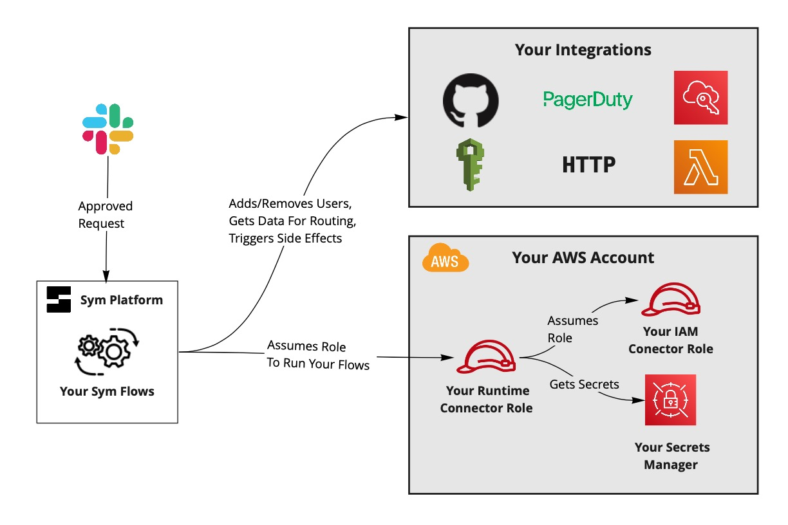
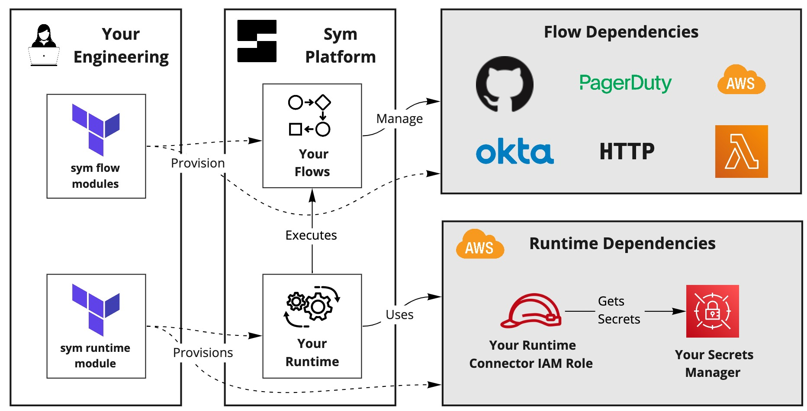

# Sym AWS IAM Quickstart

A starter template to get an AWS IAM access workflow set up for your team.

## Tutorial

Check out a step-by-step tutorial [here](https://aws-iam.tutorials.symops.com).

## Data Flow

When an End-User approves an escalation request, the Sym Platform does the following:

1. Assumes your [Runtime Connector](https://docs.symops.com/docs/runtime-connector) IAM role. This role lives in your AWS account, and has the permission to assume an IAM role allowed to modify IAM groups through [role chaining](https://docs.aws.amazon.com/IAM/latest/UserGuide/id_roles_terms-and-concepts.html).
2. Adds or removes the user from the appropriate group in IAM.

### Security Considerations

Sym's Runtime Connector IAM Role has a trust relationship with Sym's production AWS account. This trust relationship allows the Sym platform to securely assume your Runtime Connector IAM role without a password. This is called a "role chaining" type of trust relationship.

The RuntimeConnector module ensures that we use an [external id](https://docs.aws.amazon.com/IAM/latest/UserGuide/id_roles_create_for-user_externalid.html) when assuming your IAM Role per AWS best practices.

## Repo layout

Your engineers provision resources in both AWS and Sym. You can mix and match your Terraform resources in whatever way works best for your organization. Our default setup puts shared configurations in the `sym-runtime` module and makes it easy to add new modules for specific Flows.

### environments

This repo contains both Terraform environments and modules. Environments represent actual provisioned resources in AWS and Sym. Modules are reusable components that you can parameterize and deploy to multiple environments.

The [prod environment](environments/prod) is where we can iterate on the access workflow logic and test with initial users. Once we've got a setup that we like, we can set up a sandbox environment that we'll use for safe future iteration.

### sym-runtime module

The [`sym-runtime`](modules/sym-runtime) creates a shared Runtime that executes all your Flows.

### aws-iam-target

The [`aws-iam-target`](modules/aws-iam-target) is an optional helper to set up target IAM groups for Sym flows. See the [`README`](modules/aws-iam-target/README.md) for more details.

### aws-iam-flow

The [`aws-iam-flow`](modules/aws-iam-flow) module defines the workflow that your engineers will use to get temporary IAM access.

## About Sym

This workflow is just one example of how [Sym Implementers](https://docs.symops.com/docs/deploy-sym-platform) use the [Sym SDK](https://docs.symops.com/docs) to create [Sym Flows](https://docs.symops.com/docs/flows) that use the [Sym Approval](https://docs.symops.com/docs/sym-approval) Template.
